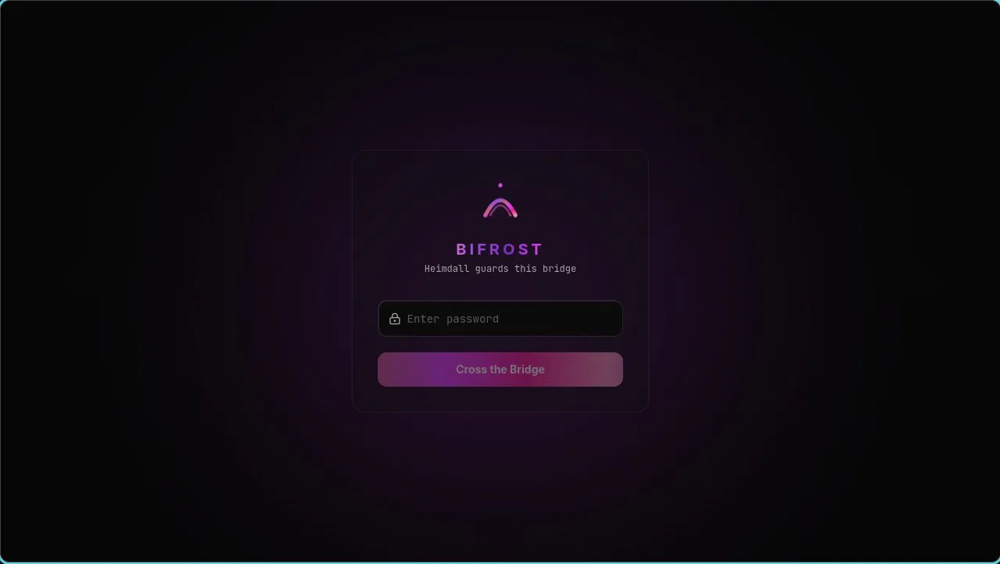
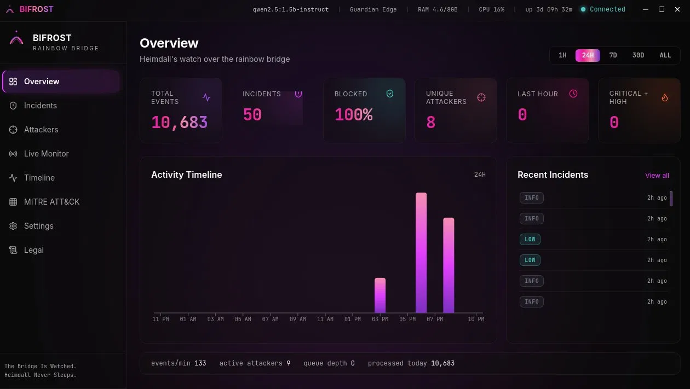
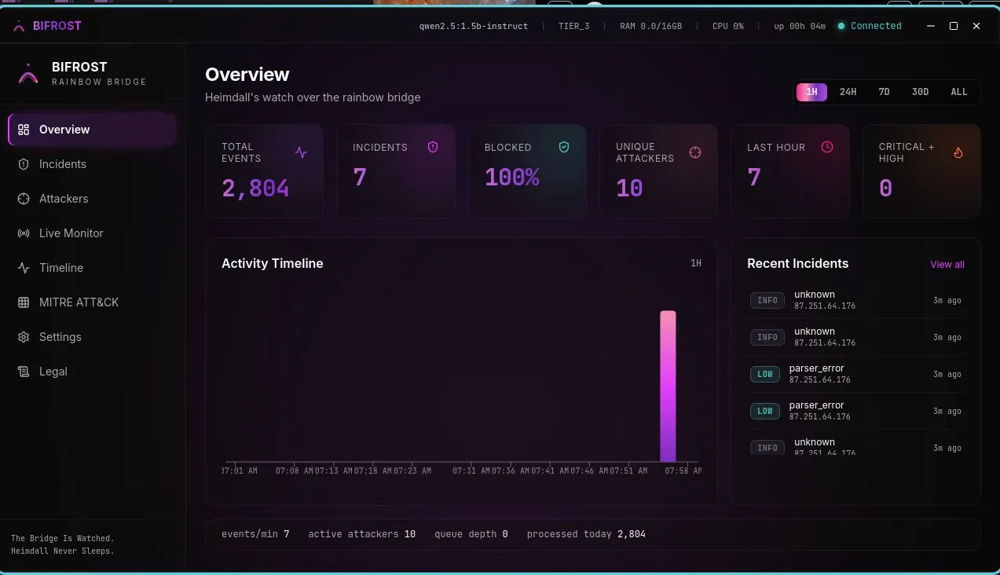
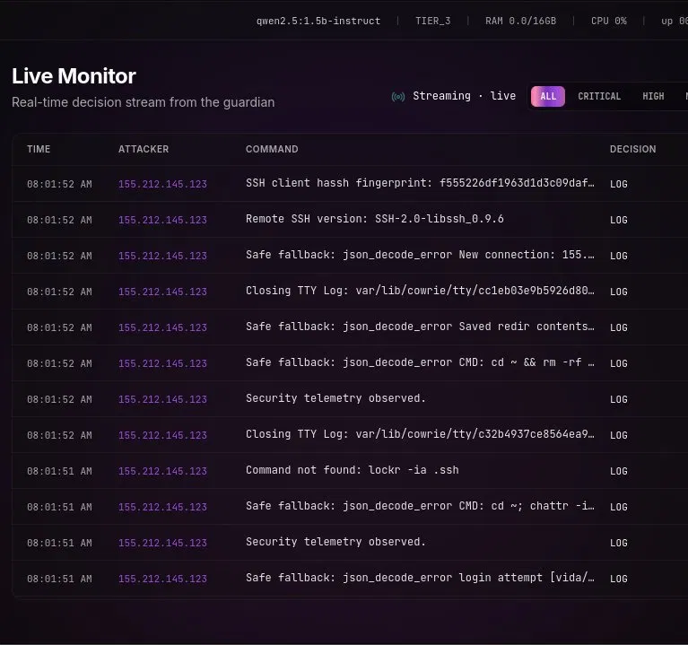
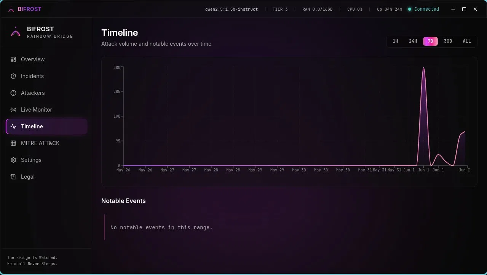
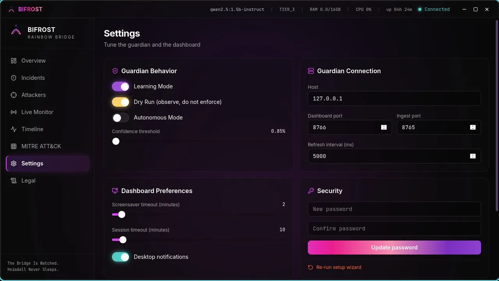
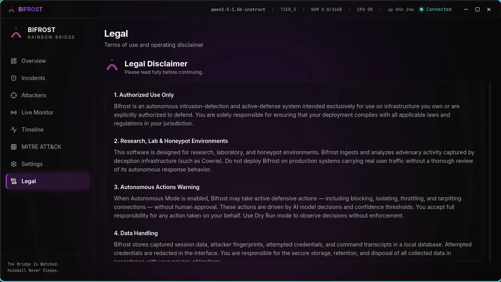
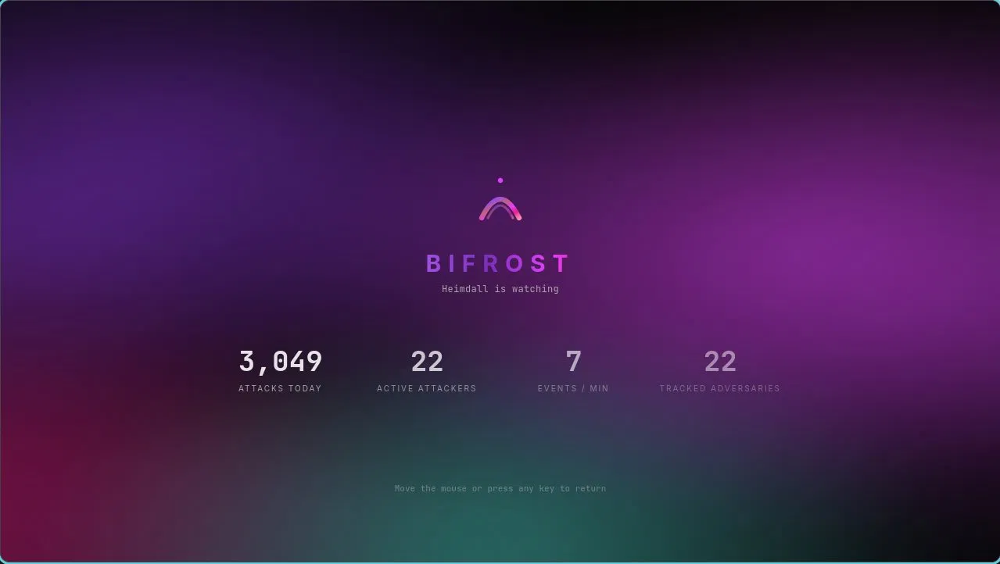

<div align="center">

# BIFROST

**Local AI-Powered Endpoint Detection & Response**

[]()
[]()
[]()

*Heimdall Never Sleeps.*

</div>

---

## What is Bifrost?

Bifrost is an open source AI-powered Endpoint Detection and Response (EDR) platform built for security researchers, homelab operators, and anyone running honeypot infrastructure.

It watches your network in real time, ingests attack data from honeypots and host telemetry, reasons about threat severity using a local AI model, classifies attacks against the MITRE ATT&CK framework, and gives you a native desktop command center to see everything that's hitting your network.

**100% local. No cloud. No SaaS. Your data never leaves your machine.**

~17,033 lines of code (tracked text/code files, as of 2026-06-03).

## Features

- **Local AI Reasoning** — Powered by Ollama, runs entirely on your hardware
- **Real-Time Detection** — Sub-200ms inference on commodity hardware
- **MITRE ATT&CK Mapping** — Every incident automatically classified
- **Native Desktop App** — Tauri v2 + React, not a browser tab
- **Honeypot Integration** — Ingests from Cowrie and other deception infrastructure
- **Live Monitor** — Real-time stream of attacker decisions
- **Safe Defaults** — Learning mode on, dry run on, autonomous actions disabled until you enable them
- **Built for Researchers** — Designed for controlled lab environments and authorized testing

## Screenshots

### Login



### Overview



### Incidents



### Attackers



### Live Monitor


### Timeline



### MITRE


### Settings



### Legal



### Screensaver



## Requirements

- Linux with AppImage support (glibc-based distros recommended)
- Ollama with a compatible model (default: qwen2.5:1.5b-instruct)
- 8GB RAM minimum, 16GB recommended
- SQLite 3
- Modern Linux kernel for eBPF support

## Installation

### AppImage (Linux)

1. Download the **Bifrost v0.3.0 AppImage** from GitHub Releases.
2. Make it executable:
   ```
   chmod +x Bifrost-v0.3.0.AppImage
   ```
3. Run it:
   ```
   ./Bifrost-v0.3.0.AppImage
   ```

The AppImage bundles the desktop app, guardian, and Go sidecars — no additional installs required.

### From Source

git clone https://github.com/sierengowskisierengowski-cpu/Bifrost.git
cd Bifrost
python3 --version  # requires Python 3.11+
go version         # requires Go 1.21+
pip install -r requirements.txt --break-system-packages
make install

## Monolithic desktop build

To produce the full desktop bundle (guardian + Go sidecars + Tauri app) in one
step:

./package_monolithic.sh

The release bundles are written to:

- app/bifrost-desktop/src-tauri/target/release/bundle/appimage/*.AppImage

GitHub Actions uses the same script for release builds. The desktop icon master
asset lives at `app/bifrost-desktop/src-tauri/icons/icon.svg` and is used to
regenerate the bundled platform icons.

### Starting the Guardian (standalone)

cd /path/to/Bifrost
export PYTHONPATH=$PWD
python3 -m bifrost.guardian

The AppImage starts the guardian automatically on launch.

### Build prerequisites (Arch Linux / AppImage)

From `app/bifrost-desktop`:

```bash
sudo ./scripts/setup-linux-build-env.sh
pnpm install
pnpm desktop:preflight
APPIMAGE_EXTRACT_AND_RUN=1 pnpm tauri build --bundles appimage
```

If AppImage bundling fails with `failed to run linuxdeploy`, run
`pnpm desktop:preflight` again and ensure `~/.local/bin` is in `PATH`.

### Support bundle / diagnostics

Generate a local support bundle tarball for troubleshooting:

```bash
python3 -m bifrost --support-bundle
```

Optional output directory:

```bash
python3 -m bifrost --support-bundle --bundle-output-dir /tmp
```

## Configuration

Bifrost looks for configuration in /etc/heimdall/heimdall_config.json or ~/.config/bifrost/config.json.

Key settings:

- learning_mode (default: true) — Suppress autonomous actions while baseline is learned
- dry_run (default: true) — Observe and decide but never enforce
- autonomous_actions_enabled (default: false) — Master switch for active defense
- confidence_threshold (default: 0.85) — Minimum AI confidence to take action
- analyst_model (default: qwen2.5:1.5b-instruct) — Ollama model for reasoning

Safe defaults are intentional. Bifrost will not enforce any action against your network until you explicitly enable it.

## Architecture Overview

Bifrost is composed of:

- Guardian — Core detection engine (Python)
- Reasoner — AI inference layer (Ollama integration)
- Router — Decision routing and policy gating
- Dashboard — Local HTTP API on port 8766
- Ingest — Event collection API on port 8765
- Desktop App — Tauri v2 + React command center

## Supported Telemetry Sources

- Cowrie SSH/Telnet honeypot
- auditd process monitoring
- eBPF kernel probes
- Direct ingest via REST API

## Legal Disclaimer

1. **Authorized Use Only** — Bifrost is an autonomous intrusion-detection and active-defense system intended exclusively for use on infrastructure you own or are explicitly authorized to defend. You are solely responsible for ensuring that your deployment complies with all applicable laws and regulations in your jurisdiction.
2. **Research, Lab & Honeypot Environments** — This software is designed for research, laboratory, and honeypot environments. Bifrost ingests and analyzes adversary activity captured by deception infrastructure (such as Cowrie). Do not deploy Bifrost on production systems carrying real user traffic without a thorough review of its autonomous response behavior.
3. **Autonomous Actions Warning** — When Autonomous Mode is enabled, Bifrost may take active defensive actions — including blocking, isolating, throttling, and tarpitting connections — without human approval. These actions are driven by AI model decisions and confidence thresholds. You accept full responsibility for any action taken on your behalf. Use Dry Run mode to observe decisions without enforcement.
4. **Data Handling** — Bifrost stores captured session data, attacker fingerprints, attempted credentials, and command transcripts in a local database. Attempted credentials are redacted in the interface. You are responsible for the secure storage, retention, and disposal of all collected data in accordance with your privacy obligations.
5. **No Warranty** — This software is provided "as is", without warranty of any kind, express or implied. In no event shall the authors be liable for any claim, damages, or other liability arising from the use of this software. Detection is probabilistic and may produce false positives and false negatives.
6. **Acknowledgement** — By accepting this disclaimer you confirm that you understand the autonomous nature of this system, that you are authorized to deploy it on the target environment, and that you accept all associated risk.

## Contributing

Bifrost is built by Joseph Sierengowski as a solo open source project. Contributions, bug reports, and feature requests are welcome via GitHub issues.

## License

MIT License - see LICENSE file for details.

## Acknowledgments

Built with:
- Ollama for local AI inference
- Cowrie for honeypot integration
- Tauri for the native desktop framework
- React for the UI
- MITRE ATT&CK framework
