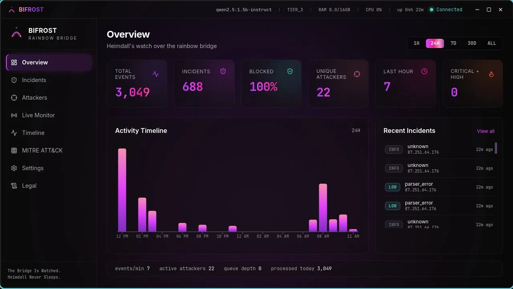
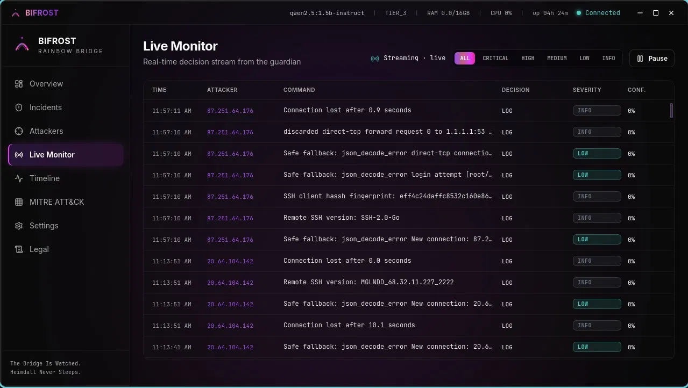
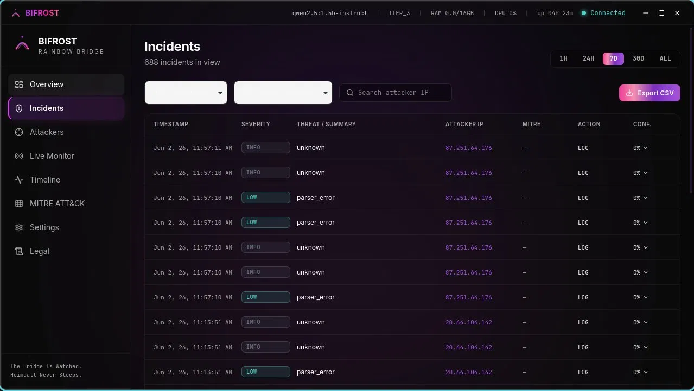
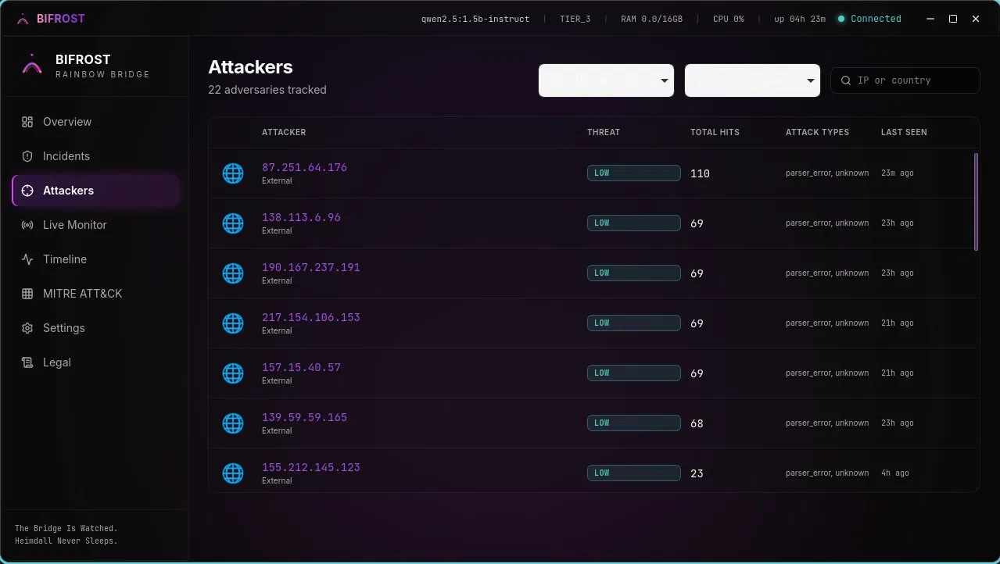

# BIFROST

**Local AI-Powered Endpoint Detection & Response**

*The Bridge Is Watched. Heimdall Never Sleeps.*

---

## What is Bifrost?

Bifrost is an open source AI-powered Endpoint Detection and Response (EDR) platform built for security researchers, homelab operators, and anyone running honeypot infrastructure.

It watches your network in real time, ingests attack data from honeypots and host telemetry, reasons about threat severity using a local AI model, classifies attacks against the MITRE ATT&CK framework, and gives you a native desktop command center to see everything that's hitting your network.

**100% local. No cloud. No SaaS. Your data never leaves your machine.**

## Features

- **Local AI Reasoning** — Powered by Ollama, runs entirely on your hardware
- **Real-Time Detection** — Sub-200ms inference on commodity hardware
- **MITRE ATT&CK Mapping** — Every incident automatically classified
- **Native Desktop App** — Tauri v2 + React, not a browser tab
- **Honeypot Integration** — Ingests from Cowrie and other deception infrastructure
- **Live Monitor** — Real-time stream of attacker decisions
- **Safe Defaults** — Learning mode on, dry run on, autonomous actions disabled until you enable them
- **Built for Researchers** — Designed for controlled lab environments and authorized testing

## Screenshots

### Overview

### Live Monitor

### Incidents

### Attackers

## Requirements

- Arch Linux (other distros may work but are not officially supported)
- Python 3.11+
- Go 1.21+
- Ollama with a compatible model (default: qwen2.5:1.5b-instruct)
- 8GB RAM minimum, 16GB recommended
- SQLite 3
- Modern Linux kernel for eBPF support

## Installation

### Arch Linux (recommended)

git clone https://github.com/sierengowskisierengowski-cpu/Bifrost.git
cd Bifrost/app/bifrost-desktop
makepkg -si

After install:

bifrost

### From Source

git clone https://github.com/sierengowskisierengowski-cpu/Bifrost.git
cd Bifrost
pip install -r requirements.txt --break-system-packages
make install

## Monolithic desktop build

To produce the full desktop bundle (guardian + Go sidecars + Tauri app) in one
step:

./package_monolithic.sh

The release bundles are written to:

- app/bifrost-desktop/src-tauri/target/release/bundle/

GitHub Actions uses the same script for release builds. The desktop icon master
asset lives at `app/bifrost-desktop/src-tauri/icons/icon.svg` and is used to
regenerate the bundled platform icons.

### Starting the Guardian

cd ~/Projects/bifrost
source bifrost_tokens.env
export PYTHONPATH=$PWD HEIMDALL_ENV=development
python3 -m bifrost.guardian

Then launch the desktop app:

bifrost

## Configuration

Bifrost looks for configuration in /etc/heimdall/heimdall_config.json or ~/.config/bifrost/config.json.

Key settings:

- learning_mode (default: true) — Suppress autonomous actions while baseline is learned
- dry_run (default: true) — Observe and decide but never enforce
- autonomous_actions_enabled (default: false) — Master switch for active defense
- confidence_threshold (default: 0.85) — Minimum AI confidence to take action
- analyst_model (default: qwen2.5:1.5b-instruct) — Ollama model for reasoning

Safe defaults are intentional. Bifrost will not enforce any action against your network until you explicitly enable it.

## Architecture Overview

Bifrost is composed of:

- Guardian — Core detection engine (Python)
- Reasoner — AI inference layer (Ollama integration)
- Router — Decision routing and policy gating
- Dashboard — Local HTTP API on port 8766
- Ingest — Event collection API on port 8765
- Desktop App — Tauri v2 + React command center

## Supported Telemetry Sources

- Cowrie SSH/Telnet honeypot
- auditd process monitoring
- eBPF kernel probes
- Direct ingest via REST API

## Important Notice

Bifrost is intended for use on infrastructure you own or are explicitly authorized to defend. You are solely responsible for ensuring your deployment complies with applicable laws and regulations.

This software is designed for research, laboratory, and honeypot environments. It is not a substitute for professional security operations and should not be deployed on production systems carrying real user traffic without thorough review of its behavior.

When autonomous mode is enabled, Bifrost may take active defensive actions including blocking, isolating, throttling, and tarpitting connections without human approval. These actions are driven by AI decisions and confidence thresholds. You accept full responsibility for any action taken on your behalf.

## Contributing

Bifrost is built by Joseph Sierengowski as a solo open source project. Contributions, bug reports, and feature requests are welcome via GitHub issues.

## License

MIT License - see LICENSE file for details.

## Acknowledgments

Built with:
- Ollama for local AI inference
- Cowrie for honeypot integration
- Tauri for the native desktop framework
- React for the UI
- MITRE ATT&CK framework
